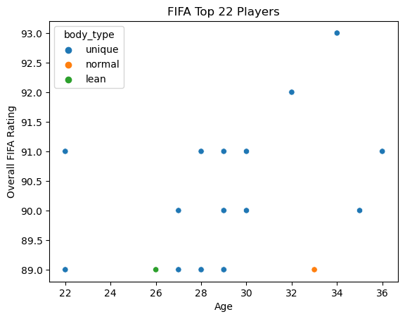

# FIFA-Dataset

## Business Problem:
  - Can we take FIFA data on players and use it to evaluate players on the field based on statistics and characteristics

  - Use the data to report back to Coaches and Owners

## Data Source
  - My data was from FIFA 22 game coming from 'https://www.kaggle.com/datasets/stefanoleone992/fifa-22-complete-player-dataset?select=Career+Mode+player+datasets+-+FIFA+15-22.xlsx'

  - This data has stats, info, and characteristics on all the players in the FIFA game 22

## Data Analysis

  - The

2 analytical insights from your data analysis.  
You can use the 2 plots from Project 2, part 3 for this!
They should include visualizations AND written interpretations
The metrics for your best model
A description of how well your model would solve your business problem
A summary with at least 2 recommendations for your stakeholders, based on your model performance AND analytical findings.
